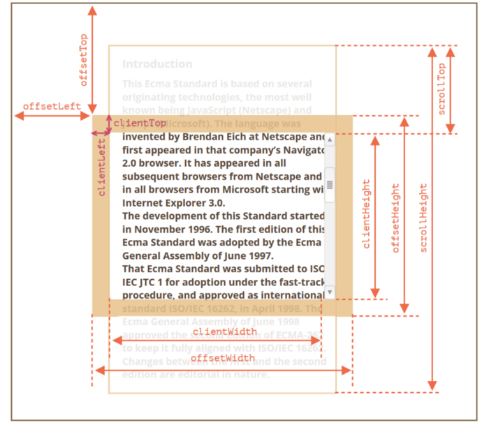

# DOM & BOM 常用操作
## 元素

### 查找元素

```js
document.querySelector(selector) // 返回 1个。找不到返回 null
document.querySelectorAll(selector) // 返回数组，包含所有满足条件的元素。找不到返回空数组。
document.getElementById(id)

el.children // 子元素
el.querySelector(selector) // 在子元素下找

el.parentNode // 父元素

el.previousElementSibling // 前一个兄弟节点
el.nextElementSibling // 后一个兄弟节点
// 所有兄弟节点
Array.prototype.filter.call(el.parentNode.children, function(child){
  return child !== el;
})
```

### 过滤元素

```js
Array.prototype.filter.call(document.querySelectorAll(selector), filterFn)
```

### 删除元素

```js
el.parentNode.removeChild(el)
```

### 获取 & 设置 HTML

```js
el.innerHTML
el.innerHTML = '<div>...</div>'
el.outerHTML // 包含自身
```

 

### 获取 & 设置  Text

```js
el.textContent
el.textContent = 'balbal...'
```

### 获取 & 设置属性

```js
el.getAttribute(attributeName)
el.setAttribute(attributeName, value)
```

## 样式

### 类名包含判断(has Class)

```js
el.classList.contains(className)
```

### 添加 & 删除类名

```js
el.classList.add(className)
el.classList.remove(className)
el.classList.toggle(className)
```

### 获取 & 设置样式

```js
// 注意 ruleName 是驼峰的。 如: marginTop 而不是 margin-top
getComputedStyle(el, null).ruleName 

el.style.ruleName = styleVale
```

### 隐藏 & 显示

```js
// 不占位
el.style.display = 'none' // 隐藏
el.style.display = '' // 显示

// 占位
el.style.visibility = 'hidden' // 隐藏
el.style.visibility = 'visible' // 显示
```

### 获取大小 & 位置信息


```js
// x, y, right, bottom 是距视口的值
const {x, y, right, bottom, width, height} = elem.getBoundingClientRect()
const top = y + document.body.scrollTop // 距页面顶部的值
const left = x + document.body.scrollLeft // 距页面左侧的值

elem.clineHeight // 包含 content height 和 padding
elem.offsetHeight // elem.clineHeight + border + margin
```

详情信息见[这里](https://developer.mozilla.org/en-US/docs/Web/API/Element/getBoundingClientRect)。

### 视口大小

```js
window.innerHeight
window.innerWidth
```

### 判断是否有滚动条

```js
//显示滚动条
elem.scrollHeight - elem.offsetHeight > 0
```

### 获取滚动条滚动距离

```js
el.scrollTop
el.scrollLeft
```

### 滚动到指定元素

```js
function scrollIntoView(scrollDom, tarDom, offset) {
    let top = getOffsetTop(tarDom) - getOffsetTop(scrollDom);
    if (offset) {
        top = top + offset;
    }
    scrollDom.scrollTo({
        top,
        behavior: 'smooth',
    });
}

// 获取 dom 元素相对于 body 的高度
function getOffsetTop(dom) {
    let totalTop = 0;

    while (dom.offsetParent) {
        totalTop += dom.offsetTop;
        dom = dom.offsetParent;
    }

    return totalTop;
}
```

### PC 上监控用户的放大，缩小的行为(触控板 + 滚轮)
```js
import { useDebounceFn } from 'ahooks'
// <div onWheel={handleZoom} />
const { run: didZoom} = useDebounceFn((event: React.WheelEvent) => {
  event.preventDefault()
  // 没有固定方向
  if(event.deltaX !== 0 && event.deltaY !== 0) {
    return
  }
  /*
  * event.ctrlKey 为 true 的情况:
  * 1. 触控板。按下 ctrl 或 两指方向不一致。
  * 2. 鼠标。按下 ctrl。
  */
  if(event.ctrlKey) { // 排除横向滚动事件。
    if (event.deltaY < 0) {
      // 放大
      if(zoomIndex < zoomConfig.length - 1) {
        script.setZoomIndex(zoomIndex + 1)
      }
    } else if (event.deltaY > 0) {
      // 缩小
      if(zoomIndex > 0) {
        script.setZoomIndex(zoomIndex - 1)
      }
    }
  }
}, {
  wait: 10,
})
```

### 异步获取下载链接，下载文件

```js
const url = await fetchDownloadLink()
location.href = url
```

## 事件

### 常见事件

- 鼠标事件: `click`,  `dblclick`, `mouseenter`,  `mouseleave`,  `mouseleave`
- 表单&键盘相关事件: `keydown`,  `keypress`,  `keyup`,  `input` , `change`
- 视图事件: `resize` , `scroll`
- 拖放事件:  `drag`,  `drageenter`, `dragleave`, `dragover`, `drop`
- 生命周期: `DOMContentLoaded`, `load`。

更多: [MDN 事件参考](https://developer.mozilla.org/zh-CN/docs/Web/Events#%E6%9C%80%E5%B8%B8%E8%A7%81%E7%9A%84%E7%B1%BB%E5%88%AB)。

### 键盘事件的常见键值(Key Value)

`event.code`的值。

- 回车: `Enter`
- esc: `Escape`
- 上下左右: `ArrowDown`,  `ArrowUp`, `ArrowLeft`,  `ArrowRight`
- f: `KeyF` 。shift + f: `KeyF`

`event.key`

- f: `f`。shift + f: `F`

### 添加事件

```js
el.addEventListener(eventName, eventHandler)
```

### 事件委托

```js
const handler = e => {} // 处理函数
document.addEventListener(eventName, function(e) {
    // 循环找到被代理的节点
    for (var target = e.target; target && target != this; target = target.parentNode) {
        if (target.matches(elementSelector)) { // elementSelector 是 子选择器
            handler.call(target, e);
            break;
        }
    }
}, false)
```

### 阻止事件冒泡

```js
event.stopPropagation()
event.nativeEvent.stopImmediatePropagation() // react 中，阻止冒泡到原生的事件绑定。
```

### 阻止默认行为

```js
event.preventDefault()
```

### 移除事件

```js
el.removeEventListener(eventName, eventHandler)
```

### 获得&失去焦点

```js
inputElem.focus()
inputElem.blur()
```

### 监听 hover

```jsx
dom.addEventListener('mouseenter', () => {
	// 进入
})
dom.addEventListener('mouseleave', e => {
	const parent = e.target;
  if (parent.contains(e.relatedTarget)) {
      return;
  }
  // 离开
})
```


### 自定义事件

```js
const event = new Event('build');
elem.addEventListener('build', handler, false);// 绑定事件
elem.dispatchEvent(event, data)// 触发事件
```

### 拖放上传文件

```tsx
const tarDOM = document.querySelector('#tar')
tarDOM.addEventListener('dragenter', (event) => {
  const fileTypes = event.dataTransfer.types
  // 在 window 下的，拖动链接是的types 为 ['text/plain', 'text/uri-list', 'text/html', 'Files']。 在 Mac 下的 没有问题，为：['text/plain', 'text/uri-list', 'text/html']
  if (fileTypes.includes('Files') || fileTypes.includes('text/uri-list') > 0) {
    return
  }
}, false)

tarDOM.addEventListener("dragover", function(event) {
  // 阻止默认动作以启用drop
  event.preventDefault();
}, false)

tarDOM.addEventListener('drop', (e) => {
  // 阻止默认动作（如打开一些元素的链接）
  e.preventDefault()
  const fileTypes = event.dataTransfer.types
  if (fileTypes.includes('Files') || fileTypes.includes('text/uri-list') > 0) {
    return
  }
  // 上传的文件
  const files = e.dataTransfer.files
}, false)
```

## [Fetch API](https://developer.mozilla.org/zh-CN/docs/Web/API/Fetch_API/Using_Fetch)

```js
fetch(url, {
    method: 'POST',
    body: JSON.stringify(data), // must match 'Content-Type' header
    headers: {
      'content-type': 'application/json'
    },
}).then(response => response.json())
```

上传文件

```js
const fileField = document.querySelector("input[type='file']");

formData.append('username', 'abc123');
formData.append('avatar', fileField.files[0]);

fetch('https://example.com/profile/avatar', {
  method: 'PUT',
  body: formData
})
```
## 操作系统判断

```js
function detectIsWindows() {
  const agent = navigator.userAgent.toLowerCase()
  return agent.indexOf('win32') >= 0 || agent.indexOf('wow32') >= 0 || agent.indexOf('win64') >= 0 || agent.indexOf('wow64') >= 0
}

function detectIsMac() {
  return /macintosh|mac os x/i.test(navigator.userAgent);
}
```

## 探测浏览器是否支持某个 HTML 属性

给元素上设置属性，再获取属性，看值是否相同。

```js
const isSupportsPlaintextEdit = () => {
    const div = document.createElement('div');
    div.setAttribute('contenteditable', 'PLAINTEXT-ONLY');

    return div.contentEditable === 'plaintext-only';
}
```

## 更多

- [how to manage HTML DOM with vanilla JavaScript only?](https://htmldom.dev/)
- [You might not need jQuery](http://youmightnotneedjquery.com/)
- [Node与Element，Children与Childnodes的区别](https://zhuanlan.zhihu.com/p/38813601)

**— 完 —**

整理By [Joel](https://github.com/iamjoel)。微信号搜索: joel007。