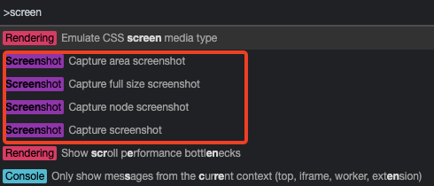

# Chrome
## 截图

截图支持指定区域，指定节点，当前页面，完整页面。步骤

1. 打开开发者工具。两种方式
    1. 命令行: ⌘Command + ⌥Option + I（Windows 为 F12）
    2. 右击选择：审查元素
2. 呼出截图命令: ⌘Command + ⇧Shift + P（Windows 为 Ctrl + Shift + P），输入 screen。

