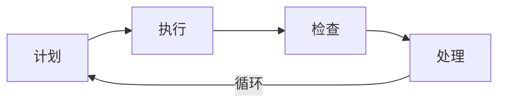
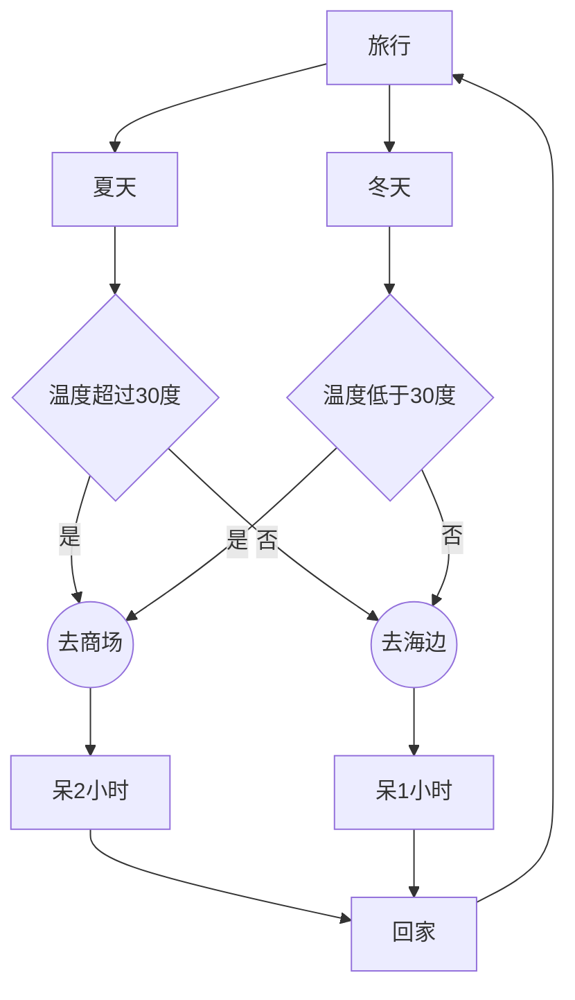
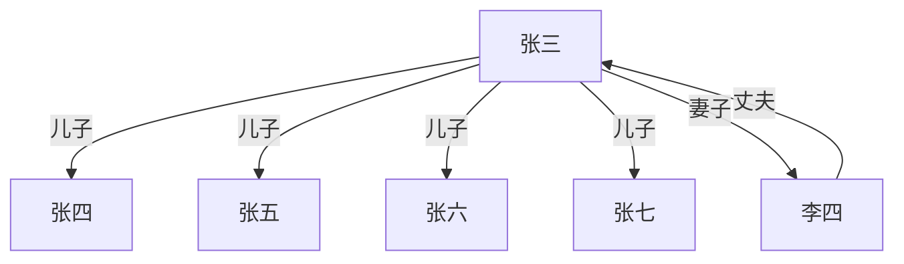
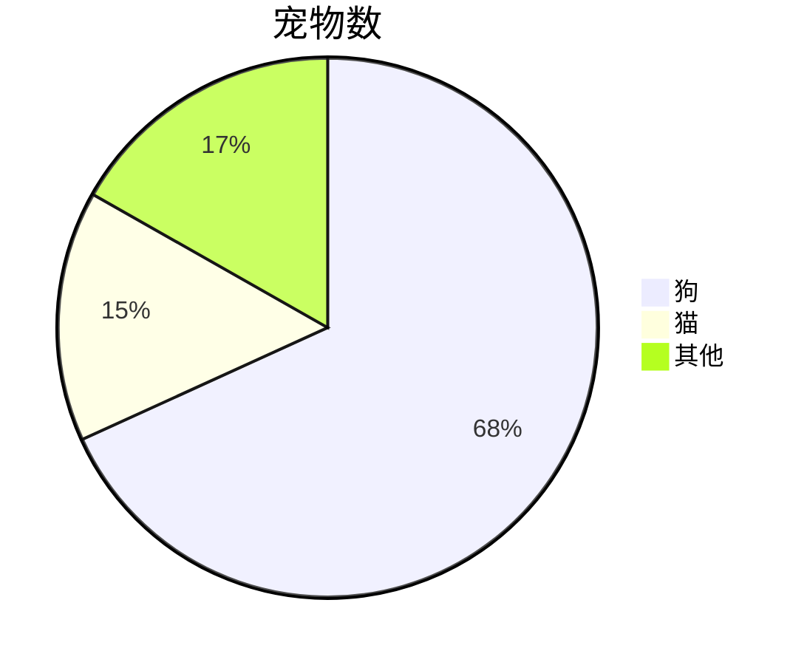
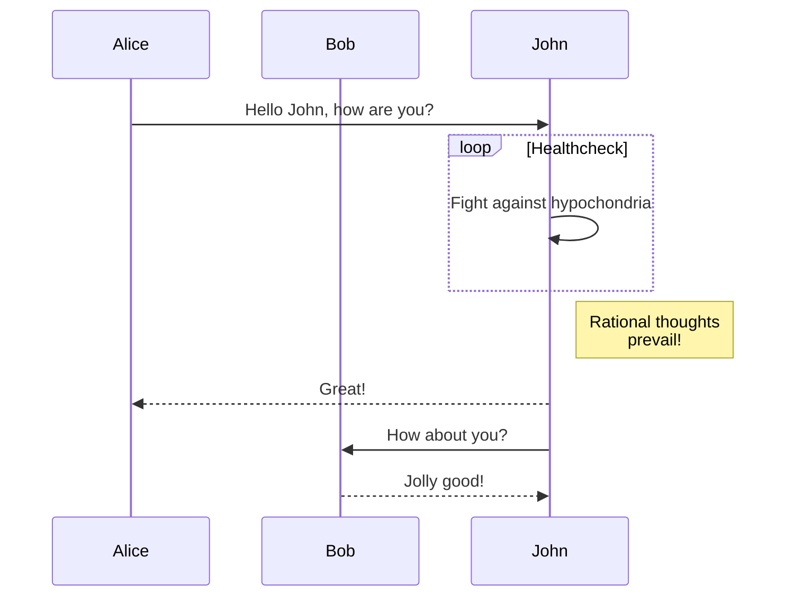

# Markdown 及扩展

## Markdown

### 表格

```markdown
| 做对齐        | 居中           | 右对齐  |
| ------------ |:-------------:| -----:|
| col 3 is      | right-aligned | $1600 |
| col 2 is      | centered      |   $12 |
| zebra stripes | are neat      |    $1 |
```

效果:
| 做对齐        | 居中           | 右对齐  |
| ------------ |:-------------:| -----:|
| col 3 is      | right-aligned | $1600 |
| col 2 is      | centered      |   $12 |
| zebra stripes | are neat      |    $1 |

### 复选框

```markdown
- [x] Be awesome
- [ ] Prepare dinner
- [ ] Sleep
```

效果:
- [x] Be awesome
- [ ] Prepare dinner
- [ ] Sleep

::: tip
GitHub 等平台。VuePress 不支持。
:::
### 强调内容

```markdown
**强调内容**
```
效果:
**强调内容**

## VuePress Mardown 拓展

### 自定义容器

```markdown
::: tip
这是一个提示
:::

::: warning
这是一个警告
:::

::: danger
这是一个危险警告
:::

::: details
这是一个详情块，在 IE / Edge 中不生效
:::
```

效果:
::: tip
这是一个提示
:::

::: warning
这是一个警告
:::

::: danger
这是一个危险警告
:::

::: details
这是一个详情块，在 IE / Edge 中不生效
:::

自定义容器的标题

```markdown
::: danger STOP
危险区域，禁止通行
:::

::: details 点击查看代码
```js
console.log('你好，VuePress！')
```

效果:
::: danger STOP
危险区域，禁止通行
:::

::: details 点击查看代码
```js
console.log('你好，VuePress！')
```
:::

## [Mermaid](https://mermaid-js.github.io/mermaid)

代码块类型: `mermaid`。

### 常规流程图

```markdown
graph LR;
    Plan[计划] --> Do[执行]
    Do --> Check[检查]
    Check --> Action[处理]
    Action --> |循环| Plan
```
效果

### 带条件分支的

```markdown
graph TD;
    t[旅行]
    t --> c1[夏天]

    c1 --> cd1{温度超过30度}
    cd1 --> |是| p1((去商场))
    p1 -->  d[呆2小时]
    d -->  h[回家]

    cd1 --> |否| p2((去海边))
    t --> c2[冬天]
    c2 --> cd3{温度低于30度}
    cd3 --> |是| p1
    cd3 --> |否| p2
    p2 -->  d3[呆1小时]
    d3 -->  h
    h -->  t
```
效果


### 人物关系图

```markdown
graph TD;
f[张三] --> |儿子| 张四
f --> |儿子| 张五
f --> |儿子| 张六
f --> |儿子| 张七
f --> |妻子| w[李四]
w --> |丈夫| f
```
效果

### 饼图

```markdown
pie title 宠物数
    "狗" : 386
    "猫" : 85
    "其他" : 95
```
效果

### 时序图

```markdown
sequenceDiagram
    participant Alice
    participant Bob
    Alice->>John: Hello John, how are you?
    loop Healthcheck
        John->>John: Fight against hypochondria
    end
    Note right of John: Rational thoughts <br/>prevail!
    John-->>Alice: Great!
    John->>Bob: How about you?
    Bob-->>John: Jolly good!
```
效果

### 工具

- [VuePress Plugin for mermaid.js](https://www.npmjs.com/package/vuepress-plugin-mermaidjs)
- VSCode 插件
    - [Markdown Preview Mermaid Support](https://marketplace.visualstudio.com/items?itemName=bierner.markdown-mermaid)
    - [Mermaid Markdown Syntax Highlighting](https://marketplace.visualstudio.com/items?itemName=bpruitt-goddard.mermaid-markdown-syntax-highlighting)